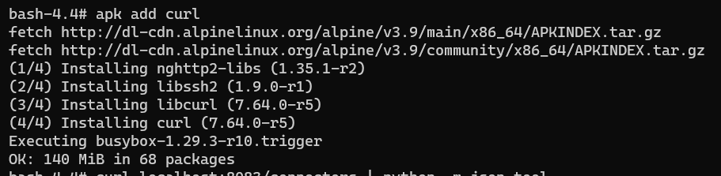
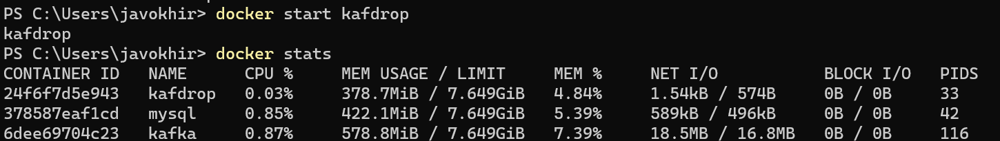

## Setting Up Environments and Preinstallations


## #1 : Creating Kafka Topic Task

- View the kafka related scripts in Bin directory
used command : `ls /opt/kafka_2.12-2.4.0/bin/`


- Kafka_home environment : `/opt/kafka_2.12-2.4.0` by using `echo $KAFKA_HOME
` command

- There is not any topic yet  

- Create and verify a new Kafka topic named “kafka-tst-01”, which has one partition and runs on one node

---

## #2 : Writing and Reading Kafka Topic Task

- Creating 2 sessions - producer and consumer and checking it
- `$KAFKA_HOME/bin/kafka-console-consumer.sh --bootstrap-server localhost:9092 --topic kafka-tst-01 --from-beginning`
- `$KAFKA_HOME/bin/kafka-console-producer.sh --broker-list localhost:9092 --topic kafka-tst-01`


- Creating another 2 sessions - a producer and a consumer, 4 in total, and check them. As you see all consumers are receiving the messages/events


- Create another session to read all events since beginning
- used command : `$KAFKA_HOME/bin/kafka-console-consumer.sh --bootstrap-server localhost:9092 --topic kafka-tst-01 --from-beginning`

- Kafka topic deletion and verifying it


---

## #3 : USING KAFKA CONNECT TO WRITE TO A DESTINATION FILE TASK

- Verifying the directories creation

- Verify the content of source file after insert data 


- Issue Kafka Connect Standalone Script
- used command : ` connect-standalone.sh $KAFKA_HOME/config/connect-standalone.properties /kafka/confFiles/connect-file-source.properties`


- Creating consumer 

- Verifying the events are coming to consumer 

- listing topics


---
## #4 : USING KAFKA CONNECT TO WRITE TO A DESTINATION FILE TASK

## #5 : KAFKA ADMINISTRATION TASK
- Listing Kafka consumer groups

- Check kafka consumer offsets

- Add apk url 

- Current running connectors 

- Active tasks

- Status 

- Configuration

- Trying to change the offset 

As we see, we can't change it when it is active
- After deactivating it

- Check target destination file


## #6 USING KAFKA TO READ FROM DATABASE
- Installing MySQL Docker Container


- Connecting sql 

- Running first query

- Verify tables and row creation

- Creating `connect-jdbc-source.properties` file with appropriate values

- Text version of the content: 
``` 
#--------------------------------------------------
#Content of connect-jdbc-source.properties
#--------------------------------------------------

#Name of the connector
name=Kafka-jdbc-source-task-1

#Connector class to be used.
connector.class=io.confluent.connect.jdbc.JdbcSourceConnector

#JDBC connector URL for mysql. make sure the mysql driver is in classpath.
connection.url=jdbc:mysql://172.18.0.1:3306/srcdb?user=root&password=root&allowPublicKeyRetrieval=true

#List of tables to publish. you can also use blacklists
table.whitelist=src_events

#No. of parallel tasks - Ideally one per table
tasks.max=1

#How frequently to poll from the database for new records
poll.interval.ms=2000

#mode - incrementing or timestamp+incrementing
mode=incrementing
incrementing.column.name=event_id

#Topic name to be created - This will create a topic with the prefix you specify, with
the table name appended
topic.prefix=src_events_
```
- Issuing standalone mode 

- Inserting a few records and verifying them from consumer side


- Dropping the topic


## 7 Using KAFDROP
- Kafdroop docker installation 


- Verify it is up 

- Web GUI
